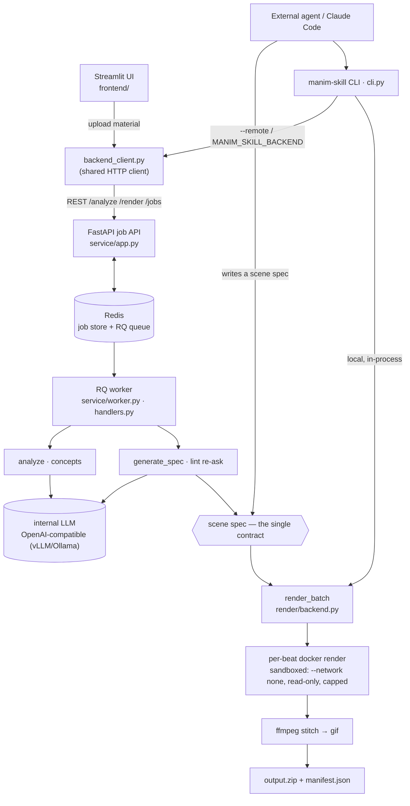

# manim-skill

*[English](README.md) · [繁體中文](README.zh-TW.md)*

Turn a **concept** — a paragraph of text, a code snippet, or a PDF — into a short **manim animation** (mp4 + gif), suitable for slides or a README.

It is an internal tool with two consumer paths that share one contract:

- **Web path** — upload material in a Streamlit UI → an internal LLM analyzes it and proposes concepts → you review and edit them → render → download a zip of mp4 + gif per concept.
- **Agent path** — an external agent (e.g. Claude Code) writes a "scene spec" itself and renders it via the `manim-skill` CLI. No LLM on this side; the agent *is* the intelligence.

Both produce and consume the same **scene spec** (a validated JSON object) and go through the same component library and the same Docker-backed render backend.

## Status

Complete — both the local core pipeline (Phase 1) and the deployable multi-user web service (Phase 2): scene-spec pipeline, component library, render backend, LLM layer, CLI + agent skill, FastAPI job API + RQ workers, Streamlit frontend, and ARM64 / airgapped docker-compose packaging.

## Requirements

- Python ≥ 3.12
- Docker (rendering runs in a container; the deployed service runs as a docker-compose stack)

## Install (local development)

```bash
pip install -e ".[dev]"
docker build -t manim-skill:latest -f docker/Dockerfile .
```

## Usage

### Deployed service — Streamlit UI + job API

The whole system runs as one `docker compose` stack: `redis`, a FastAPI job API, an RQ worker, and a Streamlit UI.

```bash
cp .env.example .env      # edit: LLM endpoint, work dir, concurrency, ...
docker compose up -d
```

- Web UI: `http://<host>:8501` — upload → review/edit concepts → render → download.
- Job API: `http://<host>:8000`.

For the airgapped ARM64 deployment to a DGX Spark (cross-build, `docker save` bundle, transfer, `docker load`), see **[DEPLOY.md](DEPLOY.md)**.

### Agent path — the CLI

Write a scene spec as a JSON file, then:

```bash
manim-skill catalog                                # list components + their schemas
manim-skill validate path/to/spec.json             # validate without rendering
manim-skill render path/to/spec.json --workdir out                  # render locally
manim-skill render path/to/spec.json --remote http://<host>:8000    # render via the deployed backend
```

`--remote` (or the `MANIM_SKILL_BACKEND` env var) submits the spec to the deployed service and polls for the result instead of rendering in-process. If a `raw` beat fails to render, `render` prints the traceback — fix the spec and render again.

For the LLM-driven flow (input → concepts → specs → bundle) the CLI exposes the same stages the web service uses, with a review checkpoint between analyze and codegen:

```bash
# Stage 1: LLM analyze; writes <workdir>/concepts.json
manim-skill analyze paper.pdf --kind pdf -o out

# (Optional) edit out/concepts.json — drop / reorder / rewrite concepts

# Stage 2: LLM codegen for each concept; writes <workdir>/spec_NN.json
manim-skill codegen-concepts out                    # all concepts
manim-skill codegen-concepts out --indices 0,2,4    # subset

# Stage 3: local docker render; writes <workdir>/output.zip
manim-skill bundle out --quality high               # 1080p60

# Or one-shot, with an interactive pause for review between stages 1 and 2:
manim-skill demo paper.pdf --kind pdf -o out                # prompts before codegen
manim-skill demo paper.pdf --kind pdf -o out --yes          # skip the prompt
```

LLM endpoint is read from `MANIM_SKILL_LLM_BASE_URL` (default `http://localhost:11434/v1`), `MANIM_SKILL_LLM_MODEL` (default `qwen3.5-35b`), and `MANIM_SKILL_LLM_API_KEY` env vars. When an agent (Claude Code, etc.) is the human-checkpoint driver, it should call `analyze` / `codegen-concepts` / `bundle` separately and run its own review UI between them.

### Web pipeline in Python

`manim_skill.llm.run_pipeline` runs input → analyze → codegen → render directly, for scripting:

```python
from manim_skill.llm.client import OpenAIClient
from manim_skill.llm.pipeline import run_pipeline

client = OpenAIClient(base_url="http://your-llm:8000/v1", model="qwen3.5-35b")
batch = run_pipeline(client, source_text, "text", workdir="out")
print(batch.zip_path)
```

The internal LLM is reached through any OpenAI-compatible endpoint (vLLM, Ollama).

### Worked example — one paper, two paths

Both paths were run end to end on the **ORCA** paper (*ORCA: A Distributed Serving System for Transformer-Based Generative Models*, OSDI '22 — ~90K characters of extracted PDF text) over the same five concepts: iteration-level scheduling, selective batching, distributed pipeline parallelism, the end-to-end performance gain, and the overall system architecture.

**Backend path (LLM-driven).** Point the CLI at any OpenAI-compatible endpoint — here two free OpenRouter models under 35B — and it reads the PDF and writes every spec:

```bash
export MANIM_SKILL_LLM_BASE_URL=https://openrouter.ai/api/v1
export MANIM_SKILL_LLM_MODEL=nvidia/nemotron-3-nano-30b-a3b:free   # or google/gemma-4-31b-it:free
export MANIM_SKILL_LLM_API_KEY=<your-openrouter-key>

manim-skill analyze orca.pdf --kind pdf -o out/orca     # → concepts.json
# review checkpoint: edit concepts.json — drop / reorder / add concepts (we settled on 5)
manim-skill codegen-concepts out/orca                   # → spec_NN.json per concept
manim-skill bundle out/orca --quality medium            # → out/orca/output.zip
```

Rendered over the same five concepts, the two models land very differently — and the optional repair loop (the LLM is re-asked with the render traceback, up to 3× per failing `raw` beat; wired into `render_batch(..., repairer=...)`) closes most of the gap:

| Model (< 35B, free) | beats rendered | clips | how it wrote the specs |
|---|---|---|---|
| `nemotron-3-nano-30b-a3b` | 10 / 17 (59 %) | 4 / 5 | every beat hand-written as `raw` |
| &nbsp;&nbsp;+ repair loop | **16 / 17 (94 %)** | 5 / 5 | one `SyntaxError` beat fixed on re-ask |
| `gemma-4-31b-it` | 25 / 31 (81 %) | 5 / 5 | mixed — 14 component / 17 `raw` beats |
| &nbsp;&nbsp;+ repair loop | **28 / 31 (90 %)** | 5 / 5 | most failing `raw` beats fixed |

The all-`raw` small model lost a whole clip to a `SyntaxError` (it packed an entire beat onto one line) — exactly the raw-heavy failure mode `CLAUDE.md` documents for sub-35B models; the repair loop recovered it. The larger model leaned on components more, started higher, and even its leftover failures were mostly `raw` beats the repair loop couldn't fix in three tries. A bigger component-using model (nemotron-3-super class) clears 87–100 % on the same harness with no repair at all.

> **Where the repair loop runs.** The deployed web service applies it to every `raw` beat **automatically** — there is no UI toggle, so the **+ repair loop** rows above are also what the service produces out of the box (and what an agent gets when it submits a spec via `--remote`). `run_pipeline(..., repair=True)` is the in-process equivalent. The **local** `manim-skill bundle` / `render` CLI deliberately does **not** repair: on the agent path the agent itself is the repair loop — it reads the traceback, rewrites the spec, and re-renders. So the plain **no repair** rows above are exactly what local `manim-skill bundle` gives you.

**Agent path (no LLM).** The agent wrote the same five concepts as **component** specs — `TextBeat`, `PipelineDiagram`, `GraphBeat`, `TableBeat`, `PlotEvolution` — and rendered them locally:

```bash
manim-skill validate out/orca-agent/spec_00.json    # OK: 3 beat(s)
manim-skill bundle out/orca-agent --quality medium  # → out/orca-agent/output.zip
```

Result: **15 / 15 beats, 5 / 5 clips** (4.8 MB zip), no repair needed. Choosing components by hand gives every beat the shared theme and a safe layout by construction, so nothing is lost to malformed code.

#### Example output — the same paper, three ways

All clips below are medium quality (720p30), no repair. The agent path (hand-picked components) is uniformly clean; the two LLM-driven backends are more uneven, so for each model two of its stronger clips and one weaker one are shown.

**Agent path** — hand-written component specs, **15/15 beats**:

| Iteration-level scheduling | End-to-end performance gain | System architecture |
|:---:|:---:|:---:|
|  |  |  |
| `PipelineDiagram` | `TableBeat` + `PlotEvolution` | `GraphBeat` |

**`nemotron-3-nano-30b-a3b`** (< 35B, free) — every beat hand-written as `raw`, **10/17 beats**:

| ✅ System architecture | ✅ Performance gain | ⚠️ Pipeline parallelism |
|:---:|:---:|:---:|
|  |  |  |
| 5/5 beats, clean boxes | the "36×" result lands | 1/3 beats — labels collide (no safe layout) |

**`gemma-4-31b-it`** (< 35B, free) — mixed component + `raw`, **25/31 beats**:

| ✅ Model partitioning | ✅ Selective batching | ⚠️ Performance gain |
|:---:|:---:|:---:|
|  |  |  |
| bullets + a clean GPU pipeline | split → attention → merge | 2/4 beats — sparse, ragged bar chart |

That contrast *is* the design thesis: components are robust; free-form `raw` code from a small model is fragile, but the repair loop buys back most of the difference. When an LLM drives the backend path, prefer a mid/large model that picks components — and turn on the repair loop for the `raw` beats it does write.

## The scene spec

A scene spec is a JSON object: a `title`, an `aspect_ratio`, and a list of `beats`. Each beat is either a **component** (a name + `params` matching that component's schema) or a **`raw` beat** (a `code` string of manim Python, where the scene is `self`).

```json
{
  "title": "Self-Attention",
  "aspect_ratio": "16:9",
  "beats": [
    { "component": "TextBeat", "params": {"text": "Self-Attention", "style": "title"}, "duration": 2.0 },
    { "component": "MatrixOp", "params": {"op": "matmul", "a_label": "Q", "b_label": "Kᵀ", "result_label": "scores"}, "duration": 4.0 },
    { "component": "raw", "code": "c = Circle()\nself.play(Create(c))", "duration": 3.0 }
  ]
}
```

## Components

The library ships 18 components. Each declares a Pydantic parameter schema — that one declaration is the single source of truth for validation, the LLM prompt catalog, and the agent skill docs.

| Component | For |
|-----------|-----|
| `CodeWalkthrough` | code with line highlighting |
| `NeuralNetDiagram` | layered nodes + connections |
| `AttentionFlow` | token sequence + attention weights |
| `MatrixOp` | matrix multiply / transpose / reshape |
| `PlotEvolution` | a numeric series as a line graph |
| `FunctionPlot` | y = f(x) on labeled axes (sigmoid/tanh/loss curves/…) |
| `HeatmapBeat` | a 2D array as a colored grid (attention / confusion matrices) |
| `PipelineDiagram` | linear labeled boxes + arrows |
| `GraphBeat` | arbitrary nodes + edges (directed or undirected), pick a layout |
| `TableBeat` | paper-style results table, optional cell highlight |
| `OptimizationPath` | dot follows f(x) curve toward a minimum, leaves a trace |
| `FormulaBreakdown` | a LaTeX formula |
| `FormulaWalkthrough` | a LaTeX formula whose parts get boxed + captioned step by step |
| `GeometryAnim` | basic shapes + transforms |
| `TextBeat` | title cards / captions / bullet lists |
| `SectionDivider` | a numbered section / chapter title card |
| `TokenSequence` | a row of generation tokens (autoregressive decoding) |
| `TwoColumn` | two labeled columns side by side, for comparisons |

Adding a component is a single file in `manim_skill/components/` — it is auto-discovered, and the catalog and skill docs update automatically.

CJK note: the docker image bundles Noto CJK, so plain-text components (TextBeat, PipelineDiagram labels, captions, anything that flows through manim's Pango `Text()`) render Chinese / Japanese / Korean. LaTeX (`FormulaBreakdown.formula`, raw `Tex` / `MathTex`) is English-only — keep formulas pure math and put localized text in the title and caption fields.

## Architecture

Two consumer paths produce or consume the same **scene spec** and share one render backend:



- **Web path** — Streamlit → `backend_client` → the FastAPI job API → Redis/RQ → worker. It is **two independent jobs**: an `analyze` job, then (after the human review checkpoint, which lives in the Streamlit session) a `render` job that runs `generate_spec` (`mode=codegen`) then `render_batch`.
- **Agent path** — the agent writes the spec itself (no LLM); the CLI renders it locally, or (`--remote`) submits it to the same API as a `mode=spec` render job.

Strictly one-directional layers:

```
spec/         scene spec schema (Pydantic), lenient JSON parsing, validation
components/   the component library (auto-discovered, schema-bearing)
builder/      turns a spec into a manim Scene
render/       Docker-backed render backend — per-beat parallel render → stitch → gif → zip
llm/          the LLM half — model-agnostic client, analyze, codegen, repair loop, pipeline
service/      FastAPI job API + RQ worker + Redis-backed job store (the deployed backend)
frontend/     the Streamlit web UI
backend_client.py   HTTP client for the job API — shared by the CLI's remote mode and the frontend
cli.py        the manim-skill CLI
```

The render backend renders each beat independently in its own sandboxed container, in parallel, with graceful per-beat / per-clip failure handling. The service backend turns that into an async job API; the Streamlit frontend and the CLI's remote mode are both thin clients of it. The whole thing deploys as one universal Docker image via docker-compose.

See `docs/architecture.md` for the full architecture (runtime diagram + layers + render backend + service), `CLAUDE.md` for the working conventions, `docs/superpowers/` for the design specs and implementation plans, and `DEPLOY.md` for deployment.

## Development

```bash
pytest -m "not docker"     # fast suite, no Docker
pytest                     # full suite incl. Docker integration tests
```

The whole `llm/` layer and the `service/` backend are tested with fakes (`FakeLLMClient`, `fakeredis`) — no live LLM or Redis is needed for the fast suite. Docker-marked tests require Docker running and the `manim-skill:latest` image built; rebuild that image after changing anything a render touches.

### Live eval against a real LLM

`scripts/eval/run_smoke.py` points `OpenAIClient` at any OpenAI-compatible endpoint (here: OpenRouter free models) and exercises the LLM half — `analyze` / `codegen` / full pipeline — on the materials in `tests/realworld-test/` (a code snippet; the paper/report inputs aren't shipped with the repo). Two stages report per-concept success and dump the validated specs; `scripts/eval/render_specs.py` then renders them and reports per-beat results. `scripts/eval/bundle_specs.py` takes any directory of validated specs and renders them as one `render_batch`, producing a single zip + `manifest.json` — the natural end-to-end deliverable; pass `--repair --model <slug>` to re-ask the LLM to fix `raw` beats that fail (pair with `--max-workers 1` on a rate-limited free endpoint).

This is the harness the design doc deferred. A round against `nvidia/nemotron-3-super-120b-a12b:free` surfaced five raw-beat failure modes the LLM kept hitting (Scene-class wrappers, no `self.play` calls, double-escaped `\n` in JSON, cross-beat variable references, and the LaTeX sibling case) — each is now an explicit DO/DO NOT in the codegen system prompt, locked in by `tests/llm/test_codegen.py`. Re-running the broken concepts under the tightened prompt took beat-level render success from **58% → 93%**. A full end-to-end run on a Chinese DLM research report (not shipped with the repo; 64K chars → 5 concepts → 5 validated specs → 24 beats) hit **87.5 % beat success** and produced a 7.1 MB combined bundle.
