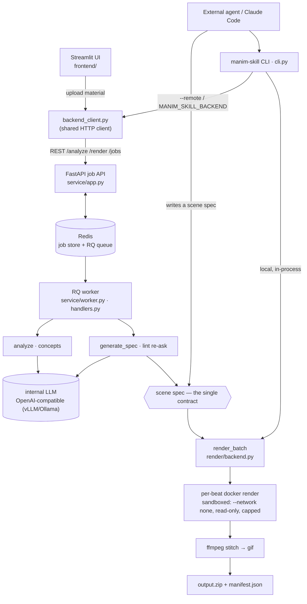

# manim-skill

*[English](README.en.md) · [繁體中文](README.md)*

把一個**概念**——一段文字、一段程式碼、或一份 PDF——轉成一支簡短的 **manim 動畫**（mp4 + gif），適合放進簡報或 README。

這是一個內部工具，有兩條共用同一份契約的消費路徑：

- **Web 路徑** — 在 Streamlit 介面上傳素材 → 內部 LLM 分析、提出概念 → 使用者審核並編輯 → 渲染 → 下載每個概念一份 mp4 + gif 的 zip。
- **Agent 路徑** — 外部 agent（例如 Claude Code）自己寫「scene spec」，透過 `manim-skill` CLI 渲染。這條路徑不涉及 LLM；agent 本身就是智慧來源。

兩條路徑產出與消費的是同一份 **scene spec**（一個驗證過的 JSON 物件），走的是同一套元件庫與同一個 Docker 渲染後端。

## 進度

已完成——本地核心 pipeline（Phase 1）與可部署的多人 Web 服務（Phase 2）都做完了：scene-spec pipeline、元件庫、渲染後端、LLM 層、CLI + agent skill、FastAPI job API + RQ workers、Streamlit 前端、以及 ARM64 / airgapped 的 docker-compose 打包。

## 環境需求

- Python ≥ 3.12
- Docker（渲染在容器內執行；部署的服務以 docker-compose stack 運行）

## 安裝（本地開發）

```bash
pip install -e ".[dev]"
docker build -t manim-skill:latest -f docker/Dockerfile .
```

## 使用方式

### 部署的服務 — Streamlit 介面 + job API

整個系統以一個 `docker compose` stack 運行：`redis`、一個 FastAPI job API、一個 RQ worker、一個 Streamlit 介面。

```bash
cp .env.example .env      # 編輯：LLM endpoint、work dir、併發數…
docker compose up -d
```

- Web 介面：`http://<host>:8501` — 上傳 → 審核/編輯概念 → 渲染 → 下載。
- Job API：`http://<host>:8000`。

要部署到 DGX Spark 的 airgapped ARM64 環境（交叉建置、`docker save` 打包、搬移、`docker load`），見 **[DEPLOY.md](DEPLOY.md)**。

### Agent 路徑 — CLI

把 scene spec 寫成一個 JSON 檔，然後：

```bash
manim-skill catalog                                # 列出元件與其 schema
manim-skill validate path/to/spec.json             # 只驗證、不渲染
manim-skill render path/to/spec.json --workdir out                  # 本地渲染
manim-skill render path/to/spec.json --remote http://<host>:8000    # 透過部署的後端渲染
```

`--remote`（或 `MANIM_SKILL_BACKEND` 環境變數）會把 spec 提交給部署的服務並輪詢結果，而非在本機 in-process 渲染。若某個 `raw` beat 渲染失敗，`render` 會印出 traceback——修正 spec 後再渲染一次。

LLM-driven 流程（輸入 → 概念 → spec → 合輯）CLI 把 web 服務同樣的階段攤出來，在 analyze 跟 codegen 之間留審核點：

```bash
# 階段 1：LLM analyze；寫 <workdir>/concepts.json
manim-skill analyze paper.pdf --kind pdf -o out

# (可選) 編輯 out/concepts.json — 刪／重排／改寫概念

# 階段 2：每個概念跑 codegen；寫 <workdir>/spec_NN.json
manim-skill codegen-concepts out                    # 全部概念
manim-skill codegen-concepts out --indices 0,2,4    # 只挑幾個

# 階段 3：本機 docker render；寫 <workdir>/output.zip
manim-skill bundle out --quality high               # 1080p60

# 或一鍵 demo，階段 1 跟 2 之間互動式停下來等審核：
manim-skill demo paper.pdf --kind pdf -o out                # codegen 前會 prompt
manim-skill demo paper.pdf --kind pdf -o out --yes          # 跳過 prompt
```

LLM endpoint 從 `MANIM_SKILL_LLM_BASE_URL`（預設 `http://localhost:11434/v1`）、`MANIM_SKILL_LLM_MODEL`（預設 `qwen3.5-35b`）、`MANIM_SKILL_LLM_API_KEY` 環境變數讀。若是 agent（Claude Code 等）擔任人工確認者，建議分別呼叫 `analyze` / `codegen-concepts` / `bundle`，自己跑審核 UI。

### 在 Python 裡跑 Web pipeline

`manim_skill.llm.run_pipeline` 直接跑「輸入 → analyze → codegen → render」，適合腳本化：

```python
from manim_skill.llm.client import OpenAIClient
from manim_skill.llm.pipeline import run_pipeline

client = OpenAIClient(base_url="http://your-llm:8000/v1", model="qwen3.5-35b")
batch = run_pipeline(client, source_text, "text", workdir="out")
print(batch.zip_path)
```

內部 LLM 透過任何 OpenAI 相容 endpoint（vLLM、Ollama）存取。

### 實作範例 — 同一篇論文、兩條路徑

兩條路徑都用 **ORCA** 論文（*ORCA: A Distributed Serving System for Transformer-Based Generative Models*，OSDI '22；PDF 取出約 90K 字）跑了完整流程，針對相同的五個概念：iteration-level scheduling、selective batching、distributed pipeline parallelism、端到端效能提升，以及整體系統架構。

**Backend 路徑（LLM 驅動）。** 把 CLI 指向任何 OpenAI 相容 endpoint —— 這裡用兩個 35B 以下的 OpenRouter 免費模型 —— 它會讀 PDF 並寫出每一份 spec：

```bash
export MANIM_SKILL_LLM_BASE_URL=https://openrouter.ai/api/v1
export MANIM_SKILL_LLM_MODEL=nvidia/nemotron-3-nano-30b-a3b:free   # 或 google/gemma-4-31b-it:free
export MANIM_SKILL_LLM_API_KEY=<你的-openrouter-key>

manim-skill analyze orca.pdf --kind pdf -o out/orca     # → concepts.json
# 審核檢查點：編輯 concepts.json — 可刪除／重排／新增概念（這裡定為 5 個）
manim-skill codegen-concepts out/orca                   # → 每個概念一份 spec_NN.json
manim-skill bundle out/orca --quality medium            # → out/orca/output.zip
```

在相同的五個概念上，兩個模型的結果差異很大 —— 而選用的修復迴圈（把 render 的 traceback 餵回 LLM 重問，每個失敗的 `raw` beat 最多 3 次；透過 `render_batch(..., repairer=...)` 接入）能補回大半差距：

| 模型（< 35B、免費） | 成功 beat | clip | spec 怎麼寫的 |
|---|---|---|---|
| `nemotron-3-nano-30b-a3b` | 10 / 17 (59 %) | 4 / 5 | 每個 beat 都手寫成 `raw` |
| &nbsp;&nbsp;+ 修復迴圈 | **16 / 17 (94 %)** | 5 / 5 | 那個 `SyntaxError` beat 重問後被修好 |
| `gemma-4-31b-it` | 25 / 31 (81 %) | 5 / 5 | 混合 —— 14 個元件 / 17 個 `raw` beat |
| &nbsp;&nbsp;+ 修復迴圈 | **28 / 31 (90 %)** | 5 / 5 | 大多數失敗的 `raw` beat 被修好 |

全 `raw` 的小模型有一整個 clip 因 `SyntaxError` 掉了（它把一整個 beat 擠在同一行）—— 正是 `CLAUDE.md` 對 35B 以下模型記載的 raw-heavy 失敗模式；修復迴圈把它救了回來。較大的模型較常挑用元件、起點較高，連殘餘的失敗也大多是修復迴圈三次都修不動的 `raw` beat。更大、會挑用元件的模型（nemotron-3-super 等級）在同一套 harness 上不靠修復就能達 87–100 %。

> **修復迴圈在哪裡跑。** 部署的 web 服務對每個 `raw` beat **自動套用**——沒有 UI 開關，所以上表的 **+ 修復迴圈** 列也就是服務開箱即得的結果（agent 透過 `--remote` 提交 spec 時同樣會被服務端自動修復）。`run_pipeline(..., repair=True)` 是 in-process 的對應。**本地** 的 `manim-skill bundle` / `render` CLI 則刻意**不**修復：在 agent 路徑上，agent 本身就是修復迴圈——它讀 traceback、改 spec、重渲染。所以上表的 **無修復** 列正是本地 `manim-skill bundle` 會給你的結果。

**Agent 路徑（無 LLM）。** 由 agent 把相同的五個概念寫成 **元件** spec — `TextBeat`、`PipelineDiagram`、`GraphBeat`、`TableBeat`、`PlotEvolution` — 並在本地渲染：

```bash
manim-skill validate out/orca-agent/spec_00.json    # OK: 3 beat(s)
manim-skill bundle out/orca-agent --quality medium  # → out/orca-agent/output.zip
```

結果：**15 / 15 個 beat、5 / 5 個 clip**（4.8 MB zip），完全不需修復。手動挑元件讓每個 beat 天生就帶有共用主題與安全版面，所以不會有任何東西因為程式碼壞掉而消失。

#### 範例輸出 — 同一篇論文、三種來源

以下所有 clip 皆為 medium 畫質（720p30）、未經修復。agent 路徑（手挑元件）一致地乾淨；兩個 LLM 驅動的 backend 則參差不齊，所以每個模型各放兩個較好的 clip 和一個較差的。

**Agent 路徑** — 手寫元件 spec，**15/15 個 beat**：

| 迭代層級排程 | 端到端效能提升 | 系統架構 |
|:---:|:---:|:---:|
|  |  |  |
| `PipelineDiagram` | `TableBeat` + `PlotEvolution` | `GraphBeat` |

**`nemotron-3-nano-30b-a3b`**（< 35B、免費）— 每個 beat 都手寫成 `raw`，**10/17 個 beat**：

| ✅ 系統架構 | ✅ 效能提升 | ⚠️ 管線平行 |
|:---:|:---:|:---:|
|  |  |  |
| 5/5 beat，方塊乾淨 | 「36×」結果有呈現 | 1/3 beat —— 標籤重疊（沒有安全版面） |

**`gemma-4-31b-it`**（< 35B、免費）— 元件 + `raw` 混合，**25/31 個 beat**：

| ✅ 模型切分 | ✅ Selective batching | ⚠️ 效能提升 |
|:---:|:---:|:---:|
|  |  |  |
| 條列 + 乾淨的 GPU 管線 | 合併 → attention → 再合併 | 2/4 beat —— 稀疏、凌亂的長條圖 |

這個對比正是整套設計的核心論點：元件穩健、小模型自由發揮的 `raw` 程式碼脆弱，但修復迴圈能買回大半差距。當由 LLM 驅動 backend 路徑時，優先選會挑用元件的中大型模型 —— 並為它確實寫出的 `raw` beat 開啟修復迴圈。

## Scene spec

一份 scene spec 是一個 JSON 物件：一個 `title`、一個 `aspect_ratio`、和一串 `beats`。每個 beat 不是一個**元件**（元件名稱 + 符合該元件 schema 的 `params`），就是一個 **`raw` beat**（一段 manim Python 的 `code` 字串，場景即 `self`）。

```json
{
  "title": "Self-Attention",
  "aspect_ratio": "16:9",
  "beats": [
    { "component": "TextBeat", "params": {"text": "Self-Attention", "style": "title"}, "duration": 2.0 },
    { "component": "MatrixOp", "params": {"op": "matmul", "a_label": "Q", "b_label": "Kᵀ", "result_label": "scores"}, "duration": 4.0 },
    { "component": "raw", "code": "c = Circle()\nself.play(Create(c))", "duration": 3.0 }
  ]
}
```

## 元件

元件庫內含 18 個元件。每個元件宣告一份 Pydantic 參數 schema——這份宣告是驗證、LLM prompt 目錄、agent skill 文件三者的單一事實來源。

| 元件 | 用途 |
|------|------|
| `CodeWalkthrough` | 程式碼，含逐行高亮 |
| `NeuralNetDiagram` | 分層節點 + 連線 |
| `AttentionFlow` | token 序列 + 注意力權重 |
| `MatrixOp` | 矩陣相乘 / 轉置 / reshape |
| `PlotEvolution` | 把數值序列畫成折線圖 |
| `FunctionPlot` | y = f(x) 帶座標軸（sigmoid / tanh / loss 曲線 …） |
| `HeatmapBeat` | 2D 陣列彩色熱圖（attention / confusion matrix） |
| `PipelineDiagram` | 線性標籤方塊 + 箭頭 |
| `GraphBeat` | 任意 nodes + edges（有向或無向），可選佈局 |
| `TableBeat` | 論文式結果表格，可標記某 cell |
| `OptimizationPath` | 紅點沿 f(x) 曲線走向最小值，留下軌跡 |
| `FormulaBreakdown` | LaTeX 公式 |
| `FormulaWalkthrough` | LaTeX 公式逐段框選 + 加註解 |
| `GeometryAnim` | 基本形狀 + 變換 |
| `TextBeat` | 標題卡 / 字幕 / 條列 |
| `SectionDivider` | 有編號的章節標題卡 |
| `TokenSequence` | 一排生成 token（自回歸解碼） |
| `TwoColumn` | 左右兩欄並排，用於對照 |

新增一個元件只需要在 `manim_skill/components/` 放一個檔案——會被自動探索，目錄與 skill 文件也會自動更新。

中文渲染：docker image 已內建 Noto CJK，所有走 manim Pango `Text()` 的路徑（TextBeat、PipelineDiagram label、caption 等）都能正確渲染繁體 / 簡體中文 / 日韓字。LaTeX 路徑（`FormulaBreakdown.formula`、raw `Tex` / `MathTex`）目前**只支援英文**——公式內請保持純數學，中文放到 title / caption 即可。

## 架構

兩條消費路徑都生產或消費同一份 **scene spec**,並共用同一個 render backend:



- **Web 路徑** — Streamlit → `backend_client` → FastAPI job API → Redis/RQ → worker。是**兩個獨立 job**:先一個 `analyze` job,再(經過存在於 Streamlit session 的人工審查檢查點後)一個 `render` job,跑 `generate_spec`(`mode=codegen`)再 `render_batch`。
- **Agent 路徑** — agent 自己寫 spec(不經 LLM);CLI 在本地渲染,或(`--remote`)把 spec 當 `mode=spec` 的 render job 送到同一個 API。

嚴格的單向分層：

```
spec/         scene spec schema（Pydantic）、寬鬆 JSON 解析、驗證
components/   元件庫（自動探索、自帶 schema）
builder/      把一份 spec 轉成 manim Scene
render/       Docker 渲染後端 — 逐 beat 平行渲染 → stitch → gif → zip
llm/          LLM 半邊 — model-agnostic client、analyze、codegen、repair loop、pipeline
service/      FastAPI job API + RQ worker + Redis-backed job store（部署的後端）
frontend/     Streamlit Web 介面
backend_client.py   job API 的 HTTP client — CLI 的 remote mode 與前端共用
cli.py        manim-skill CLI
```

渲染後端把每個 beat 在各自的沙箱容器內獨立、平行渲染，並對 beat / clip 層級的失敗做優雅處理。服務後端把它包成一個非同步的 job API；Streamlit 前端與 CLI 的 remote mode 都是它的薄 client。整個系統以一個通用 Docker image 透過 docker-compose 部署。

完整架構見 `docs/architecture.zh-TW.md`（runtime 流程圖 + 分層 + render 後端 + service），工作慣例見 `CLAUDE.md`，設計規格與實作計畫見 `docs/superpowers/`，部署見 `DEPLOY.md`。

## 開發

```bash
pytest -m "not docker"     # 快速套件，不需 Docker
pytest                     # 完整套件，含 Docker 整合測試
```

整個 `llm/` 層與 `service/` 後端都用假件測試（`FakeLLMClient`、`fakeredis`）——快速套件不需要真實 LLM 或 Redis。標 docker 的測試需要 Docker 運行中且 `manim-skill:latest` image 已建置；改了任何會被渲染碰到的東西後要重建該 image。

### 對真實 LLM 的活體評估

`scripts/eval/run_smoke.py` 把 `OpenAIClient` 指向任何 OpenAI 相容 endpoint（例：OpenRouter free 模型），用 `tests/realworld-test/` 內的素材（一段 attention 程式碼;論文/報告等輸入素材未隨 repo 提供）實際跑 LLM 半邊——`analyze` / `codegen` / 完整 pipeline——按 concept 報成功率並 dump 出已驗證的 spec；`scripts/eval/render_specs.py` 接著把這些 spec 一支一個 zip 渲染、按 beat 報結果；`scripts/eval/bundle_specs.py` 把一個目錄底下所有 `spec_*.json` 一次過送進 `render_batch`，產出單一 zip + `manifest.json`——這是最自然的「end-to-end 交付物」；加上 `--repair --model <slug>` 可在 `raw` beat 渲染失敗時重問 LLM 修復（在有限速的免費 endpoint 上搭配 `--max-workers 1`）。

這就是設計文件預留的活體評估 harness。對 `nvidia/nemotron-3-super-120b-a12b:free` 跑一輪,發現了 5 種 LLM 反覆踩到的 raw beat 失敗模式（Scene class 包裹、沒呼叫 `self.play`、JSON 把 `\n` 雙重 escape、引用其他 beat 變數,以及 LaTeX 的同類錯誤）——這 5 條現在都是 codegen system prompt 裡明確的 DO/DO NOT,由 `tests/llm/test_codegen.py` 鎖死。把破掉的 concept 用緊化過的 prompt 重跑,beat 層級渲染成功率從 **58% → 93%**。對一份中文 DLM 研究報告（未隨 repo 提供;64K 字 → 5 concepts → 5 validated specs → 24 beats）跑一次 e2e，達 **87.5% beat 成功率**，產出 7.1 MB 合輯。

