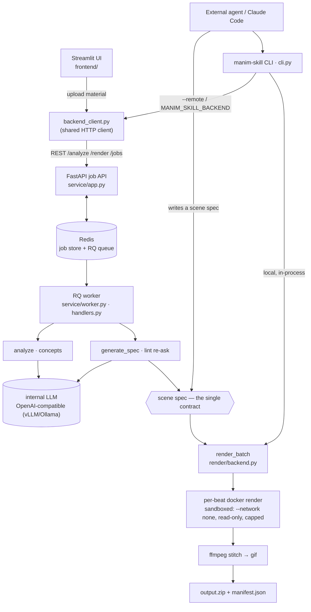
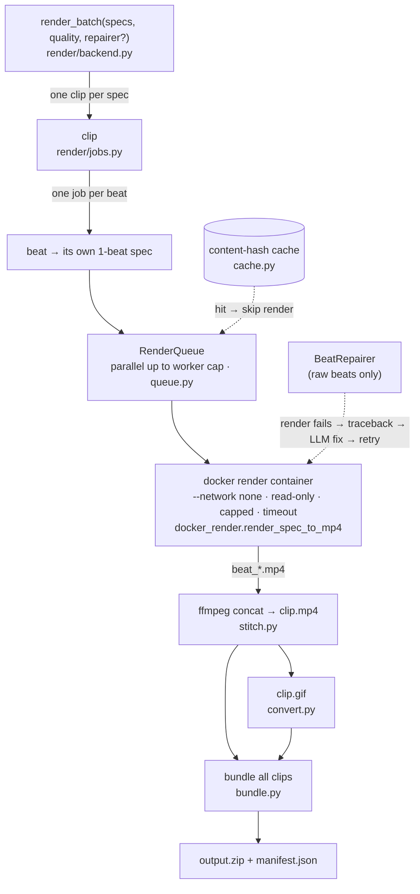

# Architecture

`manim-skill` turns a concept (text, a code snippet, or a PDF) into a short
manim animation (mp4 + gif, bundled in a zip). This document is the single
runtime + layering picture; `CLAUDE.md` carries the working conventions and
`DEPLOY.md` the deployment steps. (中文: `docs/architecture.zh-TW.md`.)

## Runtime data flow

Two consumer paths produce or consume the same **scene spec** and share one
render backend.



## The two consumer paths

- **Web path** (the deployed service) — Streamlit UI → `backend_client` (HTTP)
  → the FastAPI job API → Redis/RQ → worker. The user uploads material; an
  internal LLM analyzes it and proposes concepts; the user reviews/edits; the
  worker codegens a scene spec per concept and renders. It is **two
  independent jobs**, never a paused server-side job: an `analyze` job, then
  — after the human review checkpoint, which lives entirely in the Streamlit
  session — a `render` job (`mode=codegen`) that runs `generate_spec` then
  `render_batch`. `manim_skill.llm.pipeline.run_pipeline` is the same run
  in-process, for scripting.
- **Agent path** (the `manim-skill` CLI) — an external agent (e.g. Claude
  Code) writes a scene spec itself and renders it: locally in-process, or
  (`--remote` / `MANIM_SKILL_BACKEND`) submitted to the deployed service as a
  `mode=spec` render job (no LLM on this side). `mode=codegen` (web,
  quota-enforced) vs `mode=spec` (agent, unlimited) is the only render-job
  branch.

## Layers (strictly one-directional; `spec` is pure data with no manim import)

```
spec/         SceneSpec/Beat schema (Pydantic), lenient JSON parse, validation,
              spec lint, LaTeX escaping heuristics (latex.py)
components/   the component library (auto-discovered, schema-bearing) + the
              static harness: theme.py (palette/fonts/text factories),
              layout.py (fit_width/safe_area/stack + builder auto-clamp)
builder/      SpecScene (a MovingCameraScene that renders a spec's beats),
              raw-beat exec, themed background, camera
render/       Docker-backed render backend — per-beat parallel render → stitch
              → gif → zip, content-hash cache, graceful failure isolation
llm/          model-agnostic client, analyze, codegen (+ advisory lint re-ask),
              repair loop (raw beats only), pipeline
service/      FastAPI job API + RQ worker + Redis-backed job store (deployed backend)
frontend/     the Streamlit web UI (a thin 5-stage state machine)
backend_client.py   HTTP client for the job API — shared by the CLI's --remote
              mode and the frontend
cli.py / skill_docs.py   the agent path — thin CLI + auto-generated skill docs
```

## The scene spec — the single contract

A spec has a `title`, an `aspect_ratio`, and a list of `beats`. A beat is
either a registered **component** (`component` name + `params` matching that
component's Pydantic schema) or a **`raw` beat** (a `code` string of manim
Python, run with the scene as `self`). Everything downstream — builder, render
backend, CLI, LLM codegen — operates on this one structure. LLM output is
never trusted: always `parse_spec_text` (lenient) → `validate_spec` before
use.

**Components are the single source of truth.** Each declares a Pydantic
`Params` model; that one declaration drives param validation, the LLM prompt
catalog, and the agent skill docs. Adding a component (auto-discovered) updates
the catalog and skill docs automatically.

**The static harness** is the deterministic quality floor a weak open-source
model leans on: a semantic theme (palette + IBM Plex fonts + safe-default text
factories), layout helpers + a per-beat auto-clamp into the frame, advisory
spec lint fed back into one codegen re-ask, and bidirectional LaTeX-escaping
repair (`spec/parse.py` de-tox + `spec/latex.py` `repair_latex`). See the
specs under `docs/superpowers/`.

## Render backend



Failure is graceful and isolated: a failed beat is skipped, a failed clip
doesn't stop the batch.

`render_batch(specs, workdir, *, repairer=None, quality="medium", escalation_quota=None)`
is the entry point. Job hierarchy: **batch → clip (one per spec) → beat**. Each beat
is rendered independently as a 1-beat spec in its own docker container
(`docker_render.render_spec_to_mp4`), in parallel up to a worker cap
(`queue.RenderQueue`). A clip's beat mp4s are concatenated with ffmpeg
(`stitch.py`), converted to gif (`convert.py`), and all clips are bundled into
one zip + `manifest.json` (`bundle.py`). Failure is graceful and isolated: a
failed beat is skipped, a failed clip doesn't stop the batch. `cache.py` keys
rendered beats by content hash. The container is the security sandbox for raw
LLM code (`--network none`, `--read-only`, resource caps, timeout). `quality`
maps to manim's `-ql … -qk` flags (480p15 → 4K); default `medium` (720p30).
The `BeatRepairer` repair loop applies **only to raw beats** (render fails →
traceback fed back to the LLM → fixed code → retry); component beats are
deterministic and never repaired.

Each beat is tagged with the **cost tier** that resolved it (`deterministic`
component / `generated` raw / `model_repaired` raw / `cached` / `unresolved`).
`render/metrics.py` aggregates these into an escalation rate + free-tier rate
embedded in `manifest.json` as a `summary`; `escalation_quota` flags a batch
whose unresolved (escalation) rate exceeds the threshold. This is the
measurement layer of the cost-cascade framework
(`docs/superpowers/specs/2026-06-16-agent-openmodel-cost-cascade-design.md`).

## Service layer

`app.py` is a FastAPI `create_app` factory exposing `/analyze`, `/render`,
`/jobs/{id}`, `/jobs/{id}/result`, `DELETE /jobs/{id}`, `/catalog`, `/health`.
`worker.py` is an RQ worker whose `handlers.py` reuse `analyze` /
`generate_spec` / `render_batch` unchanged. Job records live in Redis
(`job_store.py`, JSON + TTL — no SQL DB); a Redis semaphore (`llm_throttle.py`)
caps LLM concurrency. Tested with `fakeredis`; the docker-out-of-docker render
path (the worker container spawns sibling render containers) is covered by
`tests/test_compose_e2e.py`.

## Deployment

The whole system ships as **one universal `manim-skill:latest` image** (manim
+ ffmpeg + docker CLI + Noto CJK + IBM Plex Latin + the package) running four
roles via `docker-compose.yml`: `redis`, `api`, `worker`, `ui`. The `worker`
mounts the host docker socket and spawns render containers as siblings; the
shared work dir is a same-path bind mount so those sibling containers' bind
mounts resolve on the host daemon. See `DEPLOY.md` (amd64 Linux primary; ARM64
DGX Spark as a cross-build special case).
