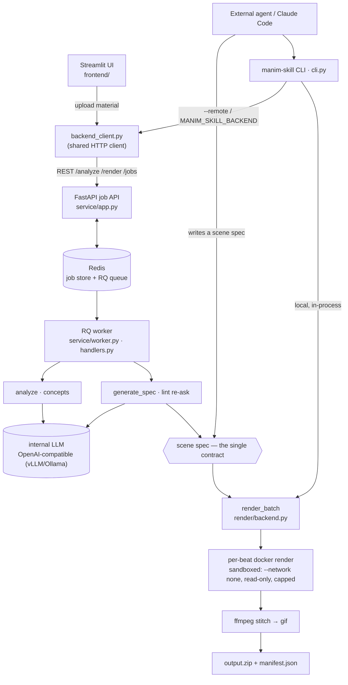
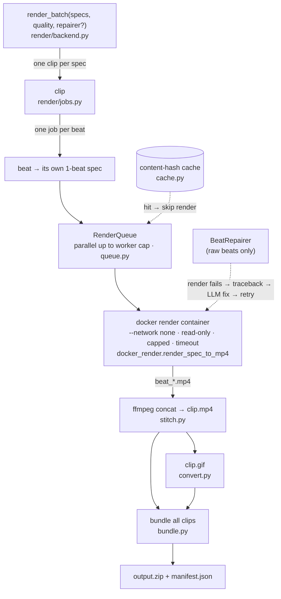

# 架構

`manim-skill` 把一個「概念」（文字、程式碼片段或 PDF）變成一支短的 manim
動畫（mp4 + gif，打包成 zip）。本文件是單一的 runtime + 分層全貌；工作慣例見
`CLAUDE.md`，部署步驟見 `DEPLOY.md`。（English: `docs/architecture.md`。）

## Runtime 資料流

兩條消費路徑都生產或消費同一份 **scene spec**，並共用同一個 render backend。



## 兩條消費路徑

- **Web 路徑**（部署的服務）— Streamlit UI → `backend_client`（HTTP）→ FastAPI
  job API → Redis/RQ → worker。使用者上傳素材；內部 LLM 分析並提出概念；使用者
  審查/編輯；worker 對每個概念 codegen 出一份 scene spec 並渲染。它是**兩個
  獨立的 job**、不是暫停中的伺服器 job：先一個 `analyze` job，再（經過完全存在
  於 Streamlit session 的人工審查檢查點後）一個 `render` job（`mode=codegen`），
  跑 `generate_spec` 再 `render_batch`。`manim_skill.llm.pipeline.run_pipeline`
  是同一段流程的 in-process 版本，供腳本使用。
- **Agent 路徑**（`manim-skill` CLI）— 外部 agent（例如 Claude Code）自己寫
  scene spec 並渲染：在本地 in-process，或（`--remote` / `MANIM_SKILL_BACKEND`）
  把 spec 當 `mode=spec` 的 render job 送到部署的服務（這一側不經 LLM）。
  `mode=codegen`（web，有配額）vs `mode=spec`（agent，無限）是 render job 唯一的
  分支。

## 分層（嚴格單向；`spec` 是純資料、不 import manim）

```
spec/         SceneSpec/Beat schema（Pydantic）、寬鬆 JSON 解析、驗證、
              spec lint、LaTeX 跳脫啟發式（latex.py）
components/   元件庫（自動探索、自帶 schema）+ 靜態 harness：theme.py
              （配色/字型/text factory）、layout.py（fit_width/safe_area/stack
              + builder 自動夾框）
builder/      SpecScene（渲染一份 spec 的 beats 的 MovingCameraScene）、
              raw-beat exec、主題背景、camera
render/       Docker 渲染後端 — 逐 beat 平行渲染 → stitch → gif → zip、
              content-hash 快取、優雅的失敗隔離
llm/          model-agnostic client、analyze、codegen（+ advisory lint re-ask）、
              repair loop（僅 raw beat）、pipeline
service/      FastAPI job API + RQ worker + Redis-backed job store（部署的後端）
frontend/     Streamlit Web 介面（薄薄的 5 階段狀態機）
backend_client.py   job API 的 HTTP client — CLI 的 --remote 模式與前端共用
cli.py / skill_docs.py   agent 路徑 — 薄 CLI + 自動產生的 skill 文件
```

## scene spec — 單一契約

一份 spec 有 `title`、`aspect_ratio`、以及一串 `beats`。一個 beat 要嘛是註冊過的
**component**（`component` 名稱 + 符合該 component Pydantic schema 的 `params`），
要嘛是 **`raw` beat**（一段 manim Python 的 `code` 字串，以 scene 當 `self` 執行）。
下游的一切——builder、render 後端、CLI、LLM codegen——都在這一個結構上運作。
LLM 輸出永不信任:一律 `parse_spec_text`（寬鬆）→ `validate_spec` 後才用。

**Component 是單一真相來源。** 每個 component 宣告一個 Pydantic `Params` model；
那一份宣告同時驅動 param 驗證、LLM prompt catalog、以及 agent skill 文件。新增一個
component（自動探索）會自動更新 catalog 與 skill 文件。

**靜態 harness** 是讓較弱開源模型可以倚靠的確定性品質下限:語意化主題（配色 +
IBM Plex 字型 + 安全預設 text factory）、版面 helper + 每個 beat 自動夾進畫面框、
advisory spec lint 餵回一次 codegen re-ask、以及雙向的 LaTeX 跳脫修復
（`spec/parse.py` 去毒網 + `spec/latex.py` `repair_latex`）。詳見
`docs/superpowers/` 下的 specs。

## Render 後端



`render_batch(specs, workdir, *, repairer=None, quality="medium", escalation_quota=None)`
是進入點。Job 階層:**batch → clip（每 spec 一個）→ beat**。每個 beat 都當成獨立的
1-beat spec、在自己的 docker 容器內渲染（`docker_render.render_spec_to_mp4`），
平行到一個 worker 上限（`queue.RenderQueue`）。一個 clip 的 beat mp4 用 ffmpeg
串接（`stitch.py`）、轉成 gif（`convert.py`），所有 clip 打包成一個 zip +
`manifest.json`（`bundle.py`）。失敗是優雅且隔離的:失敗的 beat 被跳過、失敗的
clip 不會擋住整批。`cache.py` 以 content hash 為 key 快取已渲染的 beat。容器是
raw LLM 程式碼的安全沙箱（`--network none`、`--read-only`、資源上限、timeout）。
`quality` 對應 manim 的 `-ql … -qk` 旗標（480p15 → 4K），預設 `medium`（720p30）。
`BeatRepairer` repair loop **僅作用於 raw beat**（渲染失敗 → traceback 餵回 LLM →
修好的程式碼 → 重試）；component beat 是確定性的、永不 repair。

每個 beat 會被標記解決它的**成本層**（`deterministic` component / `generated` raw /
`model_repaired` raw / `cached` / `unresolved`）。`render/metrics.py` 把這些彙總成
升級率 + 免費層率，以 `summary` 嵌進 `manifest.json`；`escalation_quota` 會在未解決
（升級）率超過門檻時標記該批。這是成本階梯框架的量測層
（`docs/superpowers/specs/2026-06-16-agent-openmodel-cost-cascade-design.md`）。

## Service 層

`app.py` 是一個 FastAPI `create_app` factory，暴露 `/analyze`、`/render`、
`/jobs/{id}`、`/jobs/{id}/result`、`DELETE /jobs/{id}`、`/catalog`、`/health`。
`worker.py` 是一個 RQ worker，其 `handlers.py` 原封不動地復用 `analyze` /
`generate_spec` / `render_batch`。Job 紀錄存在 Redis（`job_store.py`，JSON + TTL
——沒有 SQL DB）；一個 Redis 信號量（`llm_throttle.py`）限制 LLM 併發。用
`fakeredis` 測試;docker-out-of-docker 渲染路徑（worker 容器生出兄弟 render 容器）
由 `tests/test_compose_e2e.py` 覆蓋。

## 部署

整個系統以**一個通用的 `manim-skill:latest` image**（manim + ffmpeg + docker CLI
+ Noto CJK + IBM Plex Latin + 套件）出貨，透過 `docker-compose.yml` 跑四個角色:
`redis`、`api`、`worker`、`ui`。`worker` 掛載 host 的 docker socket、把 render 容器
當兄弟生出來;共用的工作目錄是 same-path bind mount，讓那些兄弟容器的 bind mount
能在 host daemon 上解析。見 `DEPLOY.md`（amd64 Linux 為主；ARM64 DGX Spark 為
cross-build 特例）。
